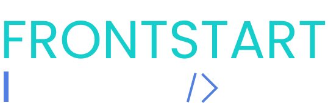

<h1 align="center">
    
</h1>

## :computer: Projeto

 Projeto desenvolvido para fins educativos feito junto do curso introdutório de front-end: FrontStart da Isadora Stangarlin. 

O projeto possuí alguns detalhes e elementos que eu reaproveitei o conhecimento de outros cursos e workshops semanais que realizei, como o FrontPush realizado pelo Násser Yousef Ali. As imagens encontradas nele são meramente ilusrativas e não me representam.

## :raising_hand: Autora

  

#### Redes Sociais:
  

- --

Dsenvolvido por Vitória Lopes 👋🏻 [Entre em contato!](https://www.linkedin.com/in/vilopesp/)
